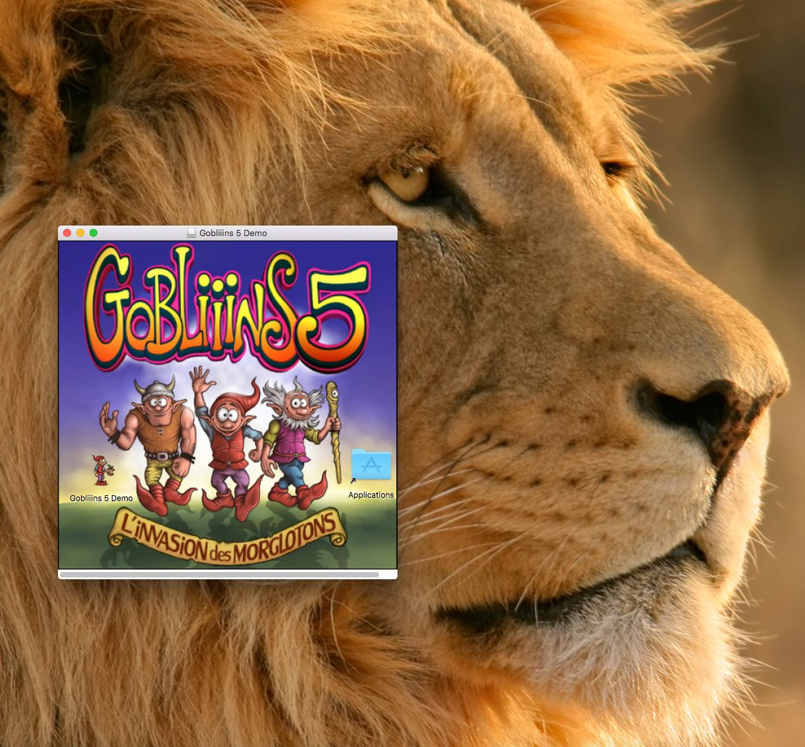

# Unofficial Gobliiins 5 Mac Demo

## Fresh out of the oven!

### Contains:
* Colorful .dmg
* Proper app bundle (built on MacOS High Sierra)
* Gobliiins 5 Part 1 (the Demo/Shareware by [Pierre Gilhodes](https://Pierre-gilhodes.itch.io/))
* Custom ScummVM 2.7.0 build
* Disabled buggy F5 in-game menu
* Modified ScummVM global menu
* Fixed a scripting bug that led to a crash early on

